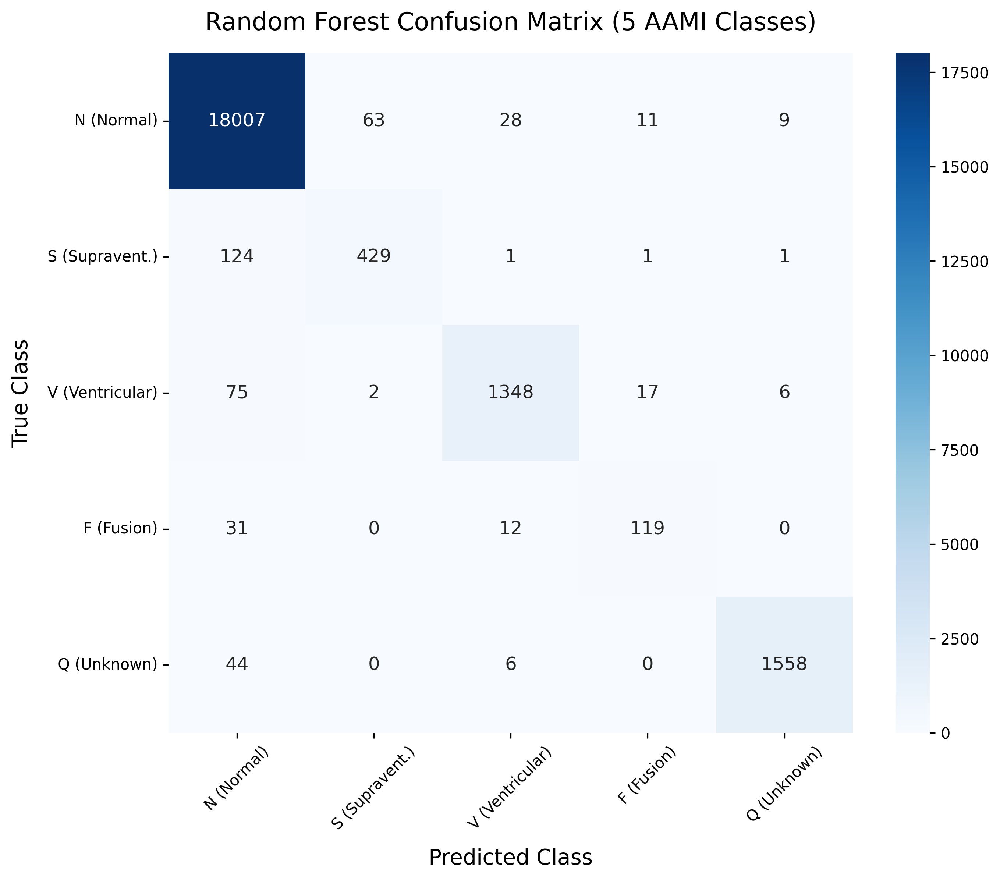

# AAMI Standard ECG Anomaly Detection

 <!-- Update this with an actual screenshot of your UI if you'd like! -->

A research-grade, full-stack Machine Learning application designed to detect and classify abnormal heartbeats into **5 standardized AAMI clinical classes** using the MIT-BIH Arrhythmia Database.

##  Key Features
*   **5-Class Multi-Classification:** Accurately classifies heartbeats into Normal (N), Supraventricular (S), Ventricular (V), Fusion (F), and Unknown (Q).
*   **Data Balancing (SMOTE):** Employs Synthetic Minority Over-sampling Technique to resolve severe class imbalances, drastically improving sensitivity for rare and fatal anomalies.
*   **Explainable AI (XAI):** Uses **SHAP** to visually decode the Random Forest's decision-making process, highlighting the exact ECG time-steps that trigger an anomaly prediction.
*   **Premium Glassmorphism UI:** A sleek, modern frontend featuring a 3D Spline background, custom magic cursor, and interactive live-detection dashboard.
*   **Real-Time REST API:** A robust Flask backend that processes raw 187-value ECG arrays and returns instantaneous predictions.

##  Technology Stack
*   **Machine Learning:** `scikit-learn`, `imbalanced-learn` (SMOTE), `shap`
*   **Data Processing:** `pandas`, `numpy`
*   **Backend API:** `Flask`, `flask-cors`, `joblib` (Model Serialization)
*   **Frontend UI:** HTML5, CSS3, Vanilla JavaScript, Spline 3D

##  How to Run Locally

### 1. Setup the Backend
Open your terminal and navigate to the project directory:
```bash
# Navigate to the Backend folder
cd Backend

# Install the required dependencies
pip install -r requirements.txt
# (If you don't have a requirements file yet, just run: pip install flask flask-cors pandas numpy scikit-learn joblib)

# Start the Flask API
python app.py
```
The backend should now be running on `http://127.0.0.1:5000/`.

### 2. Run the Frontend
Simply open the `Frontend/index.html` file in any modern web browser! 
*(For the best experience, you can use the VS Code "Live Server" extension).*

##  Dataset & Metrics
This project utilizes the **MIT-BIH Arrhythmia Database**. After applying SMOTE and training a fine-tuned Random Forest Classifier, the system achieves:
*   **Accuracy:** ~99.3%
*   **Macro Precision:** ~98.5%
*   **Macro Sensitivity (Recall):** ~97.8%

##  License
This project is open-source and available for research and educational purposes.
